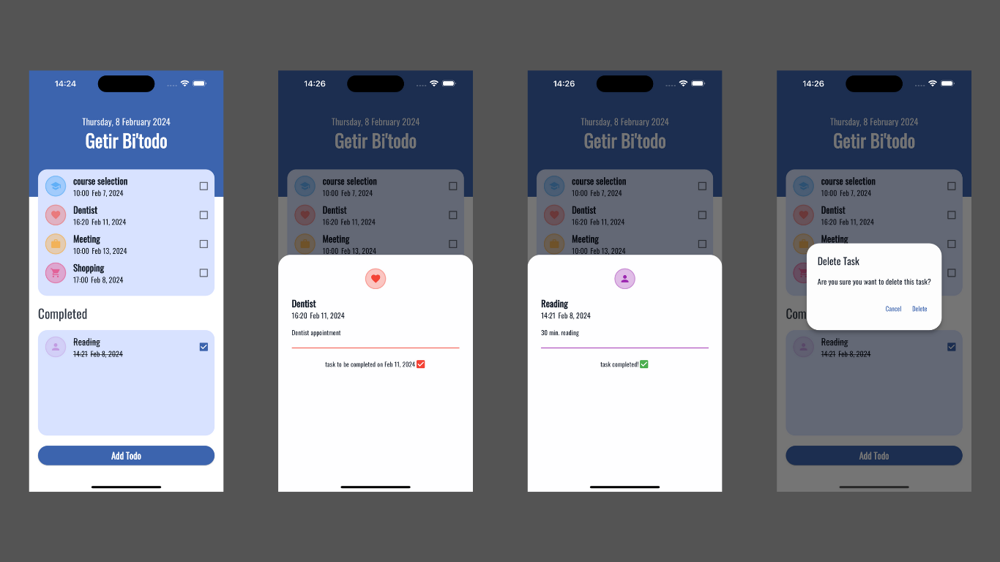
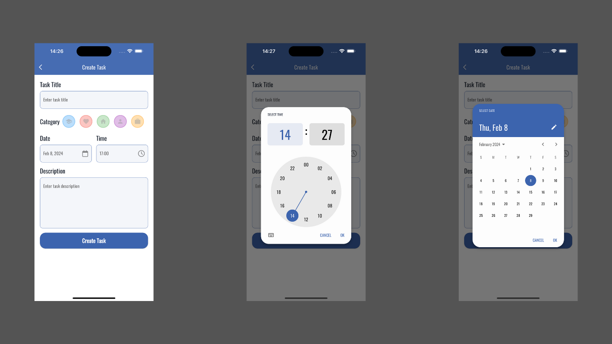

# Todo App with Flutter and Riverpod

This is a simple Todo app built using Flutter and Riverpod, demonstrating how to perform CRUD (Create, Read, Update, Delete) operations in a clean and maintainable way. Riverpod is used as the state management solution for the app, promoting a declarative and efficient approach to handling the application state.

## Features

- Create, read, update, and delete tasks.
- Efficient state management using Riverpod.
- Clean and maintainable code structure.
- Responsive user interface.

## Getting Started

To get started with this Todo app, follow these steps:

1. Clone this repository to your local machine:

``` git clone https://github.com/JosephDoUrden/flutter-todo-app-with-riverpod.git ```


2. Navigate to the project directory:

``` cd flutter-todo-app-with-riverpod ```

3. Install the required dependencies:

``` flutter pub get ```

4. Run the app:

``` flutter run ```

## Usage

Once the app is running on your device or simulator, you can perform the following actions:

- **Create**: Add new tasks by tapping on the "Create Task" button and filling out the required information.
- **Read**: View all existing tasks on the home screen. Tasks are displayed with their title, description, category, and due date.
- **Update**: Edit existing tasks by tapping on them in the task list and making changes in the edit screen.
- **Delete**: Remove tasks by swiping them horizontally in the task list and confirming the deletion.

## Screenshots




## Contributing

Contributions are welcome! If you find any bugs, have feature requests, or want to contribute to the project, feel free to open an issue or submit a pull request.

## Contact

If you have any questions, feedback, or would like to connect, feel free to reach out to me.

- **Name**: Yusufhan Saçak
- **Email**: yusufhan.sacak@bahcesehir.edu.tr
- **Personal Website**: [yusufhan.dev](https://yusufhan.dev)
- **Medium**: [Medium](https://medium.com/@yusufhansacak)
- **Twitter**: [@0xSCK](https://twitter.com/0xSCK)
- **LinkedIn**: [Yusufhan Saçak](https://www.linkedin.com/in/yusufhan-sacak/)

Feel free to contact me through any of the channels above. I'm open to collaborations and discussions related to Flutter development or any other projects.

